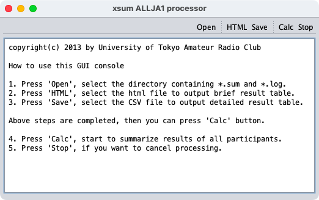
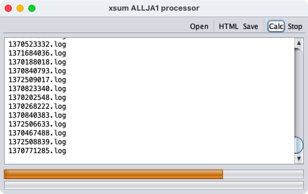

ALLJA1 ATS-2
====


Development of the ATS series was started in 2012 to streamline the tabulation process of the [ALLJA1](https://ja1zlo.u-tokyo.org/allja1) contest.

## Usage

```sh
$ java -jar xsum.jar
```




### .SUM

```
regdate, tid, uploadtype, area, `mode`, openum, band, name, callsign, portable, opplace_pref, opplace_city, postalcode, tel, address, email, `comment`, power, powertype, powersupply, equipment, licenseclass, multioplist, mobile, logform
'2013-06-03 00:11:48', 1370185908, 1, 1, 0, 0, 3, 'UTokyo', 'JA1ZLO', '1', '10', 'Meguro', '153-0041', '090-****-****', '3-8-1, Komaba, Meguro-ku, Tokyo', 'ja1zlo@example.com', 'Nice contest!', 500, 0, 'Commercial', 'FTDX3000', '1st-class', '', 0, 1
```

### .LOG

```
zLog for Windows 
2017/06/04 09:00 QP3GES       599         599 26      -     -     14   CW   1  %%OP5%%
2017/06/04 09:01 QC1UUB       599         599 100121  -     -     21   CW   1  %%OP7%%
2017/06/04 09:01 QL1GXQ       599         599 134410  -     -     50   CW   1  %%OP3%%
2017/06/04 09:02 QO1HKK       599         599 1113    -     -     14   CW   1  %%OP7%%
2017/06/04 09:02 QP3GES       599         599 26      -     -     14   CW   0  %%OP7%%
```

## Build

```sh
$ ant makejar
```

## License

### Author

[無線部開発班](https://pafelog.net)

- JG1VPP
- JJ2ULU

### Clauses

- This program is free software: you can redistribute it and/or modify it under the terms of the GNU General Public License as published by the Free Software Foundation, either version 3 of the License, or (at your option) any later version.

- This program is distributed in the hope that it will be useful, but **without any warranty**; without even the implied warranty of **merchantability or fitness for a particular purpose**.
See the GNU General Public License for more details.

- You should have received a copy of the GNU General Public License along with this program.
If not, see <http://www.gnu.org/licenses/>.
